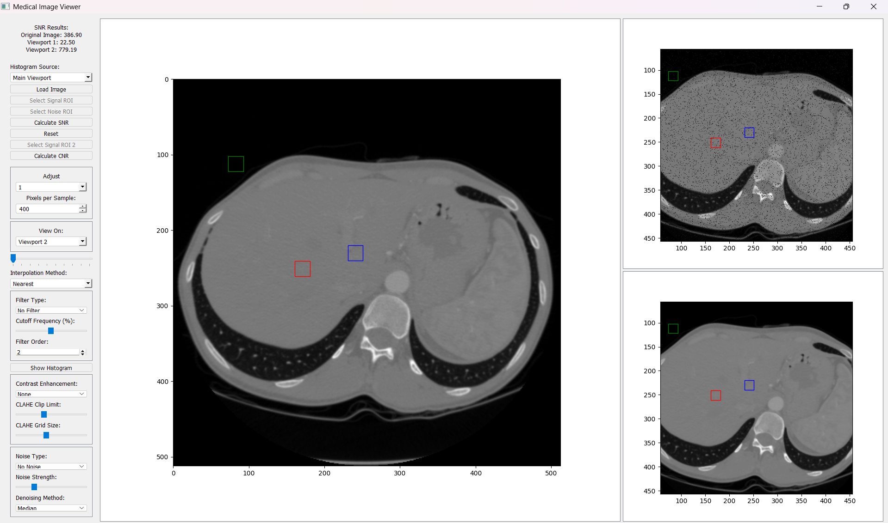
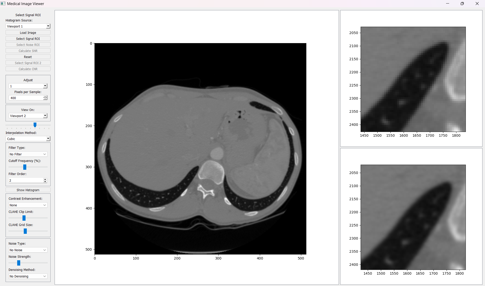
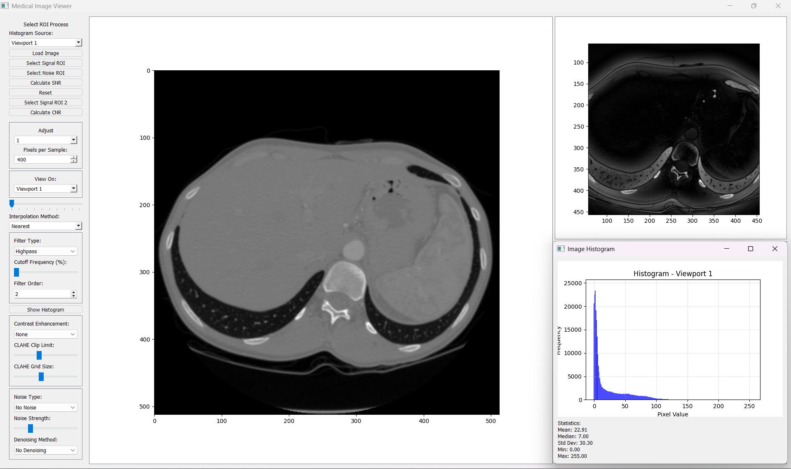

<div align="center">

# MediPixel

### Medical image processing workstation — noise, denoising, contrast enhancement, SNR/CNR

[](https://python.org)
[](https://riverbankcomputing.com/software/pyqt/)
[](LICENSE)

</div>

---

<!-- Replace with your demo GIF once recorded -->
<!--  -->

## What is MediPixel?

MediPixel is a desktop GUI for experimenting with medical image quality. You load a DICOM or standard image, then apply a chain of operations — noise addition, denoising, frequency filtering, contrast enhancement — and compare the results side by side in three linked viewports. SNR and CNR are calculated from user-drawn ROIs.

It was built as a teaching tool to make the effects of each processing step visible and measurable rather than theoretical.

---

## Features

| Category | Operations |
|---|---|
| **Noise** | Gaussian, Salt & Pepper, Poisson |
| **Denoising** | Median, Bilateral, Non-Local Means |
| **Frequency filter** | Butterworth Lowpass / Highpass (variable cutoff + order) |
| **Contrast** | Histogram Equalization, CLAHE, Adaptive Gamma Correction |
| **Metrics** | SNR and CNR from user-drawn ROIs |
| **Zoom / FOV** | Zoom slider with Nearest / Bilinear / Bicubic interpolation, adjustable FOV window |
| **Viewports** | Three independent draggable viewports for side-by-side comparison |
| **Histogram** | Live pixel intensity histogram with mean / median / std |
| **Formats** | DICOM (`.dcm`), PNG, JPEG, BMP, TIFF |

---

## Screenshots

### Noise addition and denoising


### Interpolation comparison


### Pixel intensity histogram


---

## Quick install

```bash
git clone https://github.com/BasselShaheen06/MediPixel.git
cd MediPixel
pip install .
medipixel
```

Or without installing as a package:

```bash
pip install -r requirements.txt
python main.py
```

---

## Usage

1. Click **Load image** — supports DICOM and standard formats
2. Choose a **target viewport** (1 or 2) from the dropdown
3. Adjust any combination of noise → denoising → filter → contrast sliders
4. The target viewport updates live showing the processed result
5. Draw ROIs for SNR/CNR:
   - **Signal ROI** (red) → click the bright tissue region
   - **Signal ROI 2** (blue) → click a second tissue region (for CNR)
   - **Noise ROI** (green) → click the background / air region
   - Press **Calculate SNR** or **Calculate CNR**

---

## Architecture

```
MediPixel/
├── main.py                     ← entry point (6 lines)
├── medipixel/
│   ├── core/
│   │   ├── noise.py            ← add_gaussian, add_salt_and_pepper, add_poisson
│   │   ├── denoiser.py         ← median, bilateral, non_local_means
│   │   └── contrast.py         ← histogram_equalization, clahe, adaptive_gamma,
│   │                              frequency_filter
│   └── ui/
│       ├── canvas.py           ← DraggableCanvas (click-drag panning)
│       ├── histogram.py        ← HistogramWindow (separate panel)
│       └── main_window.py      ← MedicalImageApp (Qt layout + pipeline wiring)
└── screenShots/
```

**Hard boundaries:**
- `core/` modules never import PyQt5, matplotlib, or anything UI-related
- `core/` functions are pure — they take an array, return an array, no side effects
- `ui/main_window.py` owns the processing pipeline order; it calls `core/` directly

**Processing pipeline order** (single code path, no duplication):

```
load → subsample → add noise → denoise → frequency filter → contrast → zoom → display
```

---

## The science behind each operation

### Why three noise models?
- **Gaussian** — models thermal/electronic noise in detectors. Additive, zero-mean.
- **Salt & Pepper** — models dead pixels or bit-flip errors. Impulse noise.
- **Poisson** — models photon shot noise in low-dose X-ray / nuclear imaging. Signal-dependent: brighter areas get more noise.

### Why three denoising methods?
- **Median** — best against salt & pepper. Replaces each pixel with the median of its neighbourhood. Non-linear, preserves edges.
- **Bilateral** — edge-preserving Gaussian. Weights by both spatial distance and intensity similarity, so cross-edge pixels have low weight.
- **Non-Local Means** — finds similar patches anywhere in the image and averages them. Best detail preservation, slowest.

### SNR and CNR
- **SNR** = mean(signal ROI) / std(noise ROI)
- **CNR** = |mean(signal ROI 1) − mean(signal ROI 2)| / std(noise ROI)

These are the standard NEMA and ACR metrics used in MRI and CT scanner quality assurance.

---

## Roadmap

- [x] Gaussian / Salt & Pepper / Poisson noise
- [x] Median / Bilateral / NLM denoising
- [x] Butterworth frequency filter (lowpass + highpass)
- [x] Histogram equalization / CLAHE / Adaptive gamma
- [x] SNR and CNR from drawn ROIs
- [x] Three-viewport side-by-side comparison
- [ ] DICOM metadata inspector
- [ ] Frequency domain display (magnitude spectrum)
- [ ] Export processed image
- [ ] Batch processing mode

---

## License

MIT — see [LICENSE](LICENSE).

---

<div align="center">
Built with PyQt5 · NumPy · OpenCV · Matplotlib · pydicom<br/>
Part of the <a href="https://github.com/BasselShaheen06/MedView--OpenSource_toolkit_for_Medical_Imaging">MedView open-source toolkit</a>
</div>
