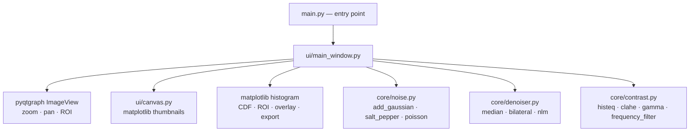

# MediPixel

**Medical image processing workstation — noise, denoising, contrast enhancement, and quantitative metrics.**

---

<!-- Replace with your actual demo GIF once recorded -->
<!--  -->

MediPixel is a desktop application for experimenting with medical image quality. Load a DICOM or standard image, apply a chain of operations — noise addition, denoising, frequency filtering, contrast enhancement — and compare results side by side. SNR and CNR are calculated from interactively drawn ROIs.

It was built as a teaching tool: every operation is visible, measurable, and scientifically grounded.

---

## At a glance

| Category | Operations |
|---|---|
| **Noise models** | Gaussian, Salt & Pepper, Poisson |
| **Denoising filters** | Median, Bilateral, Non-Local Means |
| **Frequency filters** | Butterworth Lowpass / Highpass |
| **Contrast enhancement** | Histogram Equalization, CLAHE, Adaptive Gamma |
| **Quantitative metrics** | SNR and CNR from interactive ROI boxes |
| **Histogram analysis** | Full image, ROI region, CDF overlay, multi-source comparison |
| **Image formats** | DICOM (`.dcm`), PNG, JPEG, BMP, TIFF |
| **Canvas interaction** | Scroll to zoom, drag to pan (pyqtgraph) |

---

## Architecture



| Module | Responsibility |
|---|---|
| `core/noise.py` | Pure numpy noise generators — no UI |
| `core/denoiser.py` | Pure OpenCV denoising filters — no UI |
| `core/contrast.py` | Contrast enhancement + Butterworth frequency filter |
| `ui/canvas.py` | Matplotlib `DraggableCanvas` for thumbnail viewports |
| `ui/main_window.py` | Qt layout, pyqtgraph canvas, pipeline wiring, ROI workflow |

**Hard boundary:** `core/` modules never import PyQt5, pyqtgraph, or matplotlib. They take a numpy array, return a numpy array. This means they can be used independently of the GUI — in a script, a notebook, or a different frontend.

---

## Screenshots

<!-- Add screenshots once recorded -->

---

## Quick install

```bash
git clone https://github.com/BasselShaheen06/MediPixel.git
cd MediPixel
pip install -r requirements.txt
python main.py
```

→ See [Installation](installation.md) for full setup instructions including virtual environment setup.

---

## Project context

Built as part of the Biomedical Signal and Image Processing course (SBME205), Faculty of Engineering, Cairo University. Semester 2, 2025–2026.

Part of the [MedView open-source toolkit](https://github.com/BasselShaheen06/MedView--OpenSource_toolkit_for_Medical_Imaging).